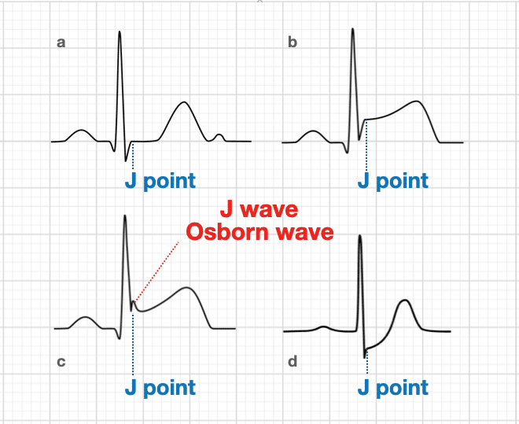

# Hypotermia

-hypotermia-asidoosi-kogulopatia = lethal triad
-Osborn wave voi tulla.

-periferia kiinni -> lämmitys alkaa -> periferia aukeaa -> core lämpötila laskee.
-Swiss staging
-HOPE score

## hoito
Ulkoinen lämmitys, lämpimät nesteet
Epästabiili hemodynamiikka -> ecmo/sydän keuhkokone.
Vaikeassa hypotermiassa iske vain kerran, elvytyslääkkeet myös käytännössä hyödyttömiä.

[^1]: SSLY lapin kokous 2026 - Vesa Lund